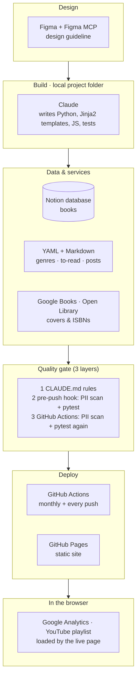
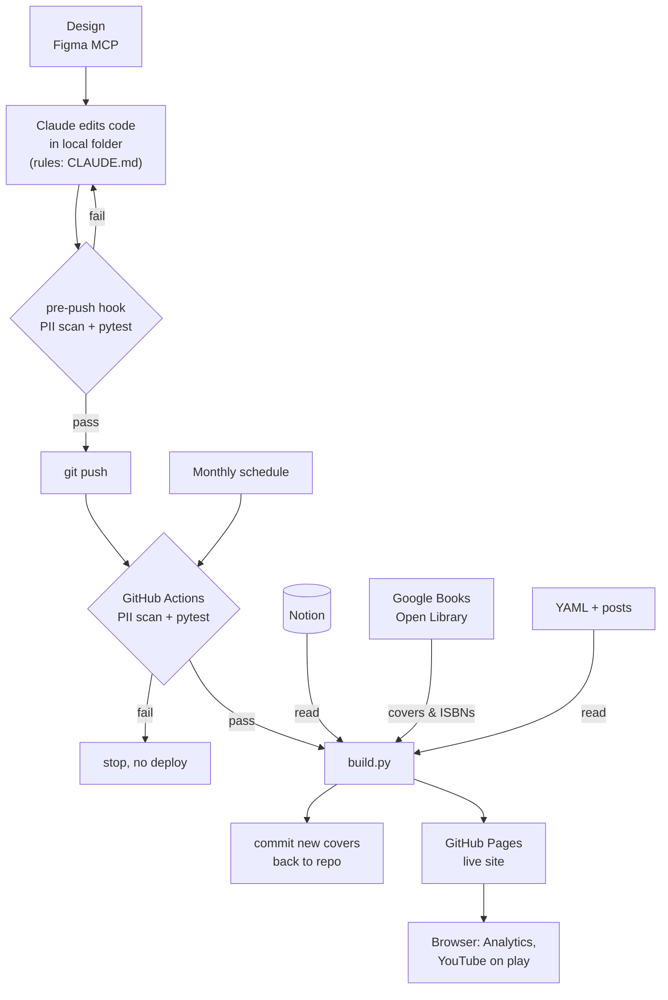

## How it works

Two views of the same system: the **stack** (what it is built from) and the **flow** (how a change reaches the live site).

### Stack

```mermaid
flowchart TB
    subgraph L1["Design"]
        F["Figma + Figma MCP<br/>design guideline"]
    end
    subgraph L2["Build · local project folder"]
        C["Claude<br/>writes Python, Jinja2 templates, JS, tests"]
    end
    subgraph L3["Data & services"]
        N[("Notion database<br/>books")]
        Y["YAML + Markdown<br/>genres · to-read · posts"]
        G["Google Books · Open Library<br/>covers & ISBNs"]
    end
    subgraph L4["Quality gate (3 layers)"]
        T["1 CLAUDE.md rules<br/>2 pre-push hook: PII scan + pytest<br/>3 GitHub Actions: PII scan + pytest again"]
    end
    subgraph L5["Deploy"]
        A["GitHub Actions<br/>monthly + every push"]
        P["GitHub Pages<br/>static site"]
    end
    subgraph L6["In the browser"]
        R["Google Analytics · YouTube playlist<br/>loaded by the live page"]
    end
    L1 --> L2 --> L3 --> L4 --> L5 --> L6
```

### Flow

```mermaid
flowchart TB
    D["Design<br/>Figma MCP"] --> W["Claude edits code<br/>in local folder<br/>(rules: CLAUDE.md)"]
    W --> LT{"pre-push hook<br/>PII scan + pytest"}
    LT -- fail --> W
    LT -- pass --> PU["git push"]
    PU --> CT{"GitHub Actions<br/>PII scan + pytest"}
    CT -- fail --> X["stop, no deploy"]
    CT -- pass --> B["build.py"]
    N[("Notion")] -- read --> B
    G["Google Books<br/>Open Library"] -- covers & ISBNs --> B
    Y["YAML + posts"] -- read --> B
    B --> CA["commit new covers<br/>back to repo"]
    B --> S["GitHub Pages<br/>live site"]
    S --> R["Browser: Analytics,<br/>YouTube on play"]
    M["Monthly schedule"] --> CT
```

