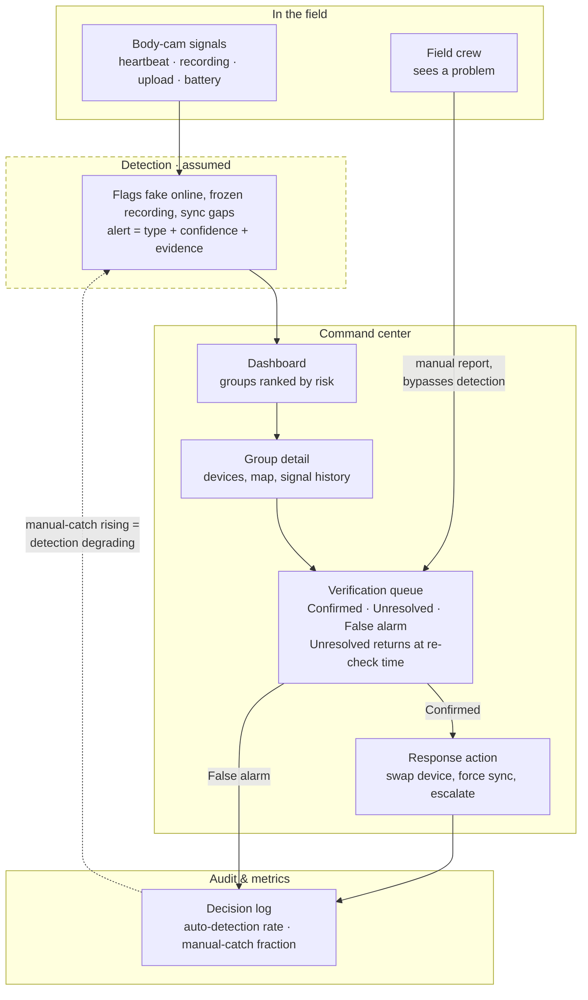

## How it works

Each layer and how they hand off. The dashed layer is assumed: the prototype feeds it simulated alerts. Everything inside **Command center** is what I designed.

```mermaid
flowchart TB
    subgraph L1["In the field"]
        S["Body-cam signals<br/>heartbeat · recording · upload · battery"]
        F["Field crew<br/>sees a problem"]
    end
    subgraph L2["Detection · assumed"]
        D["Flags fake online, frozen recording, sync gaps<br/>alert = type + confidence + evidence"]
    end
    subgraph L3["Command center"]
        DB["Dashboard<br/>groups ranked by risk"] --> GD["Group detail<br/>devices, map, signal history"]
        GD --> VQ["Verification queue<br/>Confirmed · Unresolved · False alarm<br/>Unresolved returns at re-check time"]
        VQ -- Confirmed --> R["Response action<br/>swap device, force sync, escalate"]
    end
    subgraph L4["Audit & metrics"]
        A["Decision log<br/>auto-detection rate · manual-catch fraction"]
    end
    S --> D --> DB
    F -- "manual report,<br/>bypasses detection" --> VQ
    R --> A
    VQ -- "False alarm" --> A
    A -. "manual-catch rising =<br/>detection degrading" .-> D
    style L2 stroke-dasharray: 6 4
```
